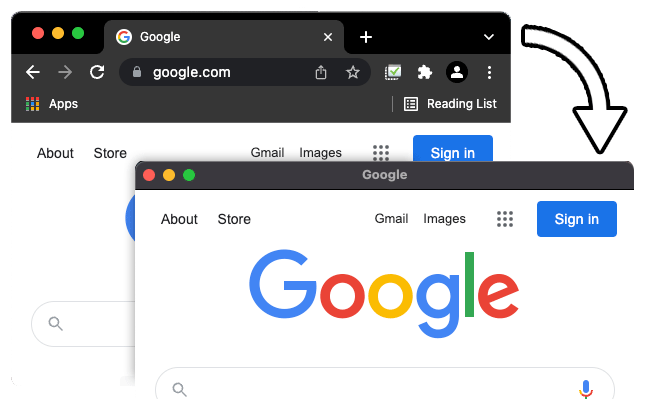

# TabFocus
A simple extension to hide the tab and menu portions of the browser window.

## Screenshot

## Description
- Opens current tab in a new popup window
- Hides the URL bar (omnibox), tabs, and bookmarks
- Reduces menu size by over 70%

## Usage
- Toggle from the context menu (right click -> Toggle TabFocus)
- Or click the extension icon

## Installation
1. Clone git repo: `git clone git@github.com:adammmmmm/tabfocus.git`
2. Open Chrome extensions (chrome://extensions)
3. Enable developer mode
4. Load upacked extension and select cloned repo folder

## License
[MIT](https://github.com/adammmmmm/tabfocus/blob/master/LICENSE)